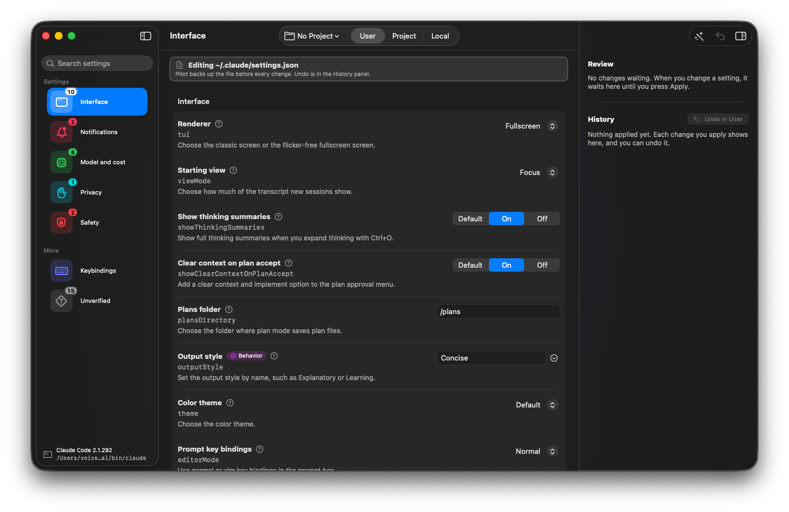
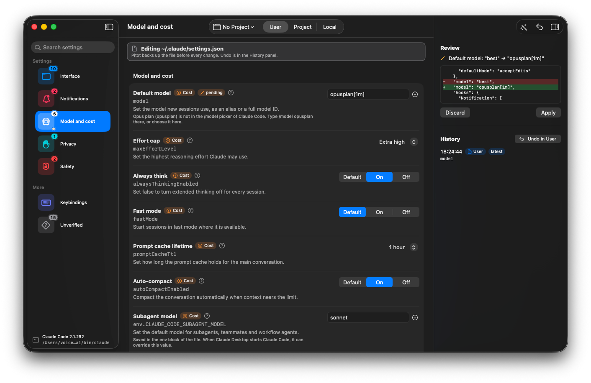

# Pitot

Pitot is a native macOS app that edits Claude Code settings files. It turns documented settings into toggles and pickers, offers presets through a few setup questions, and has an editor for keybindings. It shows a diff before every write, keeps a backup, and can undo each change.

Not affiliated with or endorsed by Anthropic. Claude and Claude Code are trademarks of Anthropic.

## Screenshots

The Interface section. Each setting shows its key, a short description and the control. The sidebar badges count the settings that are set.



A pending change in Model and cost. The review panel shows the exact lines that will change in the file. Nothing is written until you press Apply, and History keeps an undo for each change.



## What Pitot never does

- It never reads, shows or stores API keys or tokens.
- It only writes settings that the official Claude Code docs describe. Keys that are not documented are listed read-only.
- Its tests never touch your real files. They work in temporary folders.

## What it edits

- `~/.claude/settings.json`, your user settings.
- A project's `.claude/settings.json` (shared with your team) and `.claude/settings.local.json` (personal), after you choose the project folder.
- `~/.claude/keybindings.json`.

It reads managed settings to show which values your organization sets, and never writes them.

A release build edits your real files. A debug build works on a copy of your user settings and keybindings in a temporary folder, so development never changes them. Two launch options change this in any build:

- `--use-settings-copy`, or the environment variable `PITOT_USE_COPY=1`, works on the copy. Use it to try a release build safely.
- `--use-real-settings` edits the real files. When both are given, Pitot works on the copy.

## Requirements

- macOS 14 or later.
- Claude Code installed. Pitot reads its version and disables settings that need a newer one.

## Build from source

You need Xcode 27 with Swift 6 and XcodeGen.

```bash
brew install xcodegen
cd App
xcodegen generate
xcodebuild -scheme Pitot -destination 'platform=macOS' build
```

## Run the tests

```bash
cd Core && swift test                                                   # core logic
cd App && xcodegen generate && xcodebuild -scheme Pitot -destination 'platform=macOS' test
cd Tools/oracle && npm ci && node run.js --check                        # compares JSON edits with jsonc-parser
cd Tools/catalog-check && npm ci && node check.js                       # compares the catalog with the live docs
cd Tools/conformance && swift test                                      # expected values, no Claude Code needed
```

`swift run conformance` in `Tools/conformance` runs Claude Code itself on throwaway files. It uses the Haiku model and costs a few cents of Claude usage per run.

## Project layout

| Folder | What it holds |
|---|---|
| `Core/` | A Swift package with no UI and no third-party dependencies: the JSON editor that keeps your formatting, safe file writes, undo, the layer merge, the catalog loader and the keybindings model |
| `App/` | The SwiftUI app. The Xcode project is generated from `App/project.yml` |
| `Catalog/` | Data files: documented settings (`tweaks.json`), setup questions, keybindings and the read-only list of undocumented key names |
| `Fixtures/` | Settings files for the Core tests |
| `Tools/` | The test oracle, the catalog check, the conformance test, the icon generator and the release scripts |

## How the catalog stays honest

- Every editable row links to the docs page it comes from. A row the docs do not describe cannot be added: the loader rejects it.
- `Tools/catalog-check` fetches the live docs and reports every row that no longer matches. It runs before each release.
- `Tools/conformance` runs Claude Code on layered settings files and checks that Pitot predicts the same effective values. The rules it checks are in `Core/MERGE-RULES.md`.

## Security notes

- Writes are atomic: Pitot writes a temporary file in the same folder and renames it over the old one.
- Before Pitot changes an existing file, it keeps a backup. Undo puts back only the keys Pitot changed, so edits made by Claude Code or another tool survive.
- Project files are confined to the project folder. A settings file that is a link pointing outside the project is not read or written.
- Files larger than 8 MB are not opened.
- Pitot never writes `null` into a settings file, because one `null` makes Claude Code ignore the whole file.
- Updates use Sparkle with signed updates. The updater stays off until a signing key is configured, and it never checks without your permission.

## License

MIT. See `LICENSE`. Third-party components are listed in `THIRD_PARTY_NOTICES.md`.
